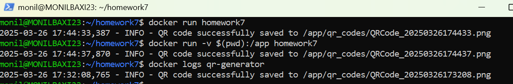

# Docker and Python

For this assignment you will be combining Docker with Python to create a program that generates a QR code PNG file that
contains a URL. The QR code can be viewed with the camera on your phone to allow a user to click on it and send them to
the target website. You must make your program generate a QR code that takes someone to your GitHub homepage i.e. https://github.com/kaw393939 <replace mine with yours>

## Setup
1.  Goto Docker.com and Install docker - [https://www.docker.com/get-started/](here)
2.  Signup for your own Docker account 

## Submission Requirements:

1. Add the QR code image that links to your own GitHub homepage that you generate to the readme.md file, so that it appears below.

PUT YOUR QR CODE IMAGE


2.  Add an image of viewing the log of successfully creating the QR code below.
 PUT YOUR LOG IMAGE HERE


### Building the Image

```sh
docker build -t homework7 .
```
This command builds a Docker image named `my-qr-app` from the Dockerfile in the current directory (`.`).

### Running the Container with Default Settings
```sh
docker run -d --name qr-generator homework7
```

Runs your QR code generator application in detached mode (`-d`) with a container named `qr-generator`.

### Setting Environment Variables for QR Code Customization

```sh
docker run -d --name qr-generator \
  -e QR_DATA_URL='https://example.com' \
  -e QR_CODE_DIR='qr_codes' \
  -e QR_CODE_FILENAME='exampleQR.png' \
  -e FILL_COLOR='blue' \
  -e BACK_COLOR='yellow' \
  homework7
```
Customizes the QR code generation settings through environment variables.

### Sharing a Volume for QR Code Output

```sh
docker run -d --name qr-generator \
  -v /host/path/for/qr_codes:/app/qr_codes \
  homework7
```
Mounts a host directory to the container for storing QR codes.

### Combining Volume Sharing and Environment Variables

```sh
docker run -d --name qr-generator \
  -e QR_CODE_DIR='qr_codes' \
  -e FILL_COLOR='blue' \
  -e BACK_COLOR='yellow' \
  -v /host/path/for/qr_codes:/app/qr_codes \
  homework7
```

A comprehensive command that configures the QR code settings and mounts volumes for QR codes.

## Setting the arg for the url from the terminal
```sh
docker run -v .:/app homework7 --url htt/www.nobdoy.com
```
This is how you would set the url for the qr code
### Basic Docker Commands Explained

**Building an Image**

```sh
docker build -t image_name .
```

Builds a Docker image with the tag `image_name` from the Dockerfile in the current directory.

**Running a Container**

```sh
docker run --name container_name image_name
```
Runs a container named `container_name` from `image_name` in the foreground / attached mode

```sh
docker run -d --name container_name image_name
```
Runs a container named `container_name` from `image_name` in detached mode

**Listing Running Containers**

```sh
docker ps
```
Shows a list of all running containers.

**Stopping a Container**

```sh
docker stop container_name
```
**Removing a Container**

```sh
docker rm container_name
```
**Listing Docker Images**


```sh
docker images
```
Lists all Docker images available on your machine.

**Removing a Docker Image**


```sh
docker rmi image_name
```

Removes a Docker image.

**Viewing Logs of a Container**

```sh
docker logs container_name
```
Displays the logs from a running or stopped container.

These commands cover the essentials of building, running, and managing Docker containers and images, along with specific examples for your QR code generation application.
